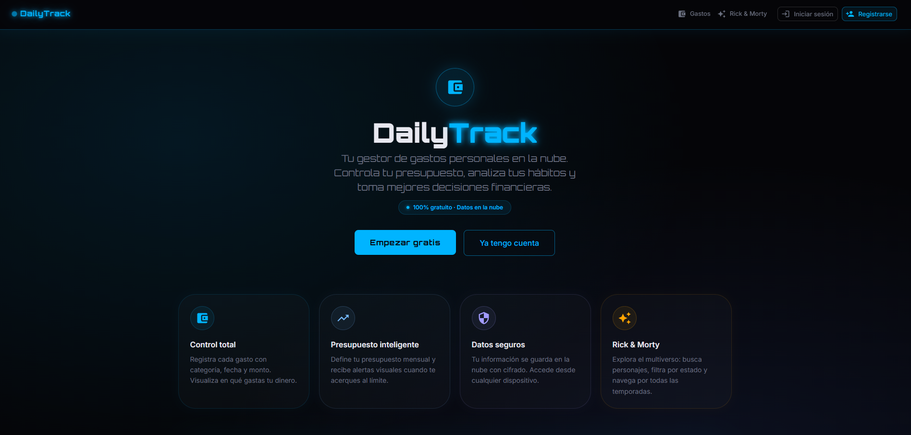
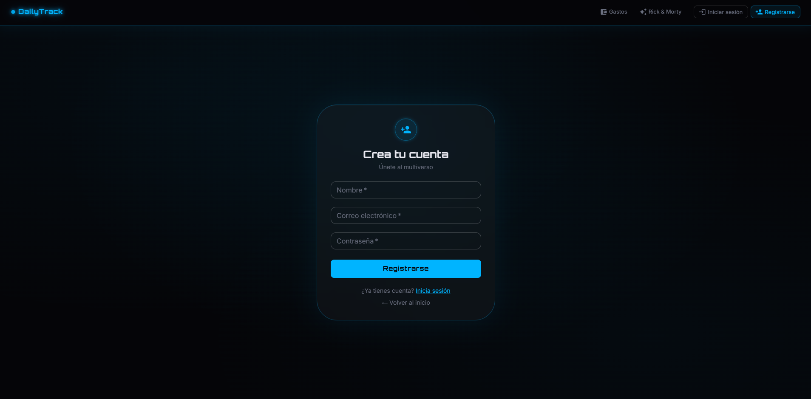
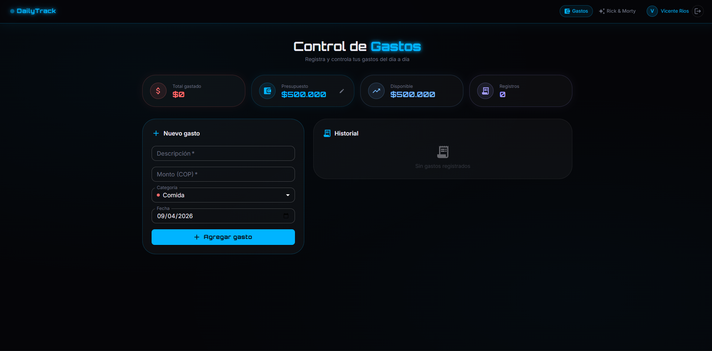

# DailyTrack

Aplicación web full-stack para el control de gastos personales con autenticación de usuarios, presupuesto configurable y explorador de personajes de Rick & Morty. Construida con React en el frontend y Node.js + MongoDB Atlas en el backend.

---

## Descripción

DailyTrack permite a los usuarios registrar sus gastos diarios, categorizarlos, visualizar su distribución por categoría y controlar cuánto han gastado respecto a su presupuesto mensual. Cada usuario tiene su propio espacio privado protegido con autenticación JWT. Los datos se almacenan en la nube mediante MongoDB Atlas, lo que permite acceder desde cualquier dispositivo.

---

## Características principales

- **Autenticación segura** — Registro e inicio de sesión con contraseñas cifradas (bcrypt) y tokens JWT con expiración de 7 días.
- **Dashboard de gastos protegido** — Solo accesible para usuarios autenticados. Redirige automáticamente al login si no hay sesión activa.
- **Página de introducción pública** — Landing page visible sin login que presenta las funcionalidades de la app.
- **Control de presupuesto** — Presupuesto mensual editable y persistido en la base de datos por usuario.
- **Categorías de gasto** — 8 categorías (Comida, Transporte, Entretenimiento, Salud, Educación, Hogar, Ropa, Otro) con colores diferenciados.
- **Historial con animaciones** — Lista de gastos con entradas/salidas animadas y eliminación individual.
- **Desglose visual por categoría** — Barras de progreso proporcionales al total gastado por categoría.
- **Explorador Rick & Morty** — Consume la API pública de Rick & Morty con búsqueda en tiempo real y paginación.
- **PWA (Progressive Web App)** — Instalable en dispositivos móviles y de escritorio, con soporte offline mediante Service Worker.
- **Diseño dark con tema azul** — UI completamente oscura con acentos en azul eléctrico (`#00b4ff`) y efectos glassmorphism.

---

## Instalación

### Requisitos previos

- Node.js v18 o superior
- Una cuenta en [MongoDB Atlas](https://atlas.mongodb.com) con un cluster configurado

### 1. Clonar el repositorio

```bash
git clone <url-del-repositorio>
cd API
```

### 2. Instalar dependencias del frontend

```bash
npm install
```

### 3. Instalar dependencias del backend

```bash
cd server
npm install
cd ..
```

### 4. Configurar variables de entorno

Edita el archivo `server/.env` con tus credenciales:

```env
# URI de conexión de MongoDB Atlas
MONGODB_URI=mongodb+srv://<usuario>:<contraseña>@<cluster>.mongodb.net/APIReact?retryWrites=true&w=majority

# Clave secreta para firmar los tokens JWT
JWT_SECRET=tu_clave_secreta_aqui

# Puerto del servidor
PORT=5000
```

> Para obtener la URI de MongoDB Atlas: accede a tu cluster → **Connect** → **Drivers** → copia la cadena de conexión.

---

## Ejecución

Se necesitan **dos terminales** abiertas simultáneamente:

**Terminal 1 — Backend:**

```bash
cd server
npm run dev
```

El servidor estará disponible en `http://localhost:5000`.

**Terminal 2 — Frontend:**

```bash
npm run dev
```

La aplicación estará disponible en `http://localhost:5173`.

### Comandos disponibles (frontend)

| Comando | Descripción |
|---|---|
| `npm run dev` | Servidor de desarrollo con HMR |
| `npm run build` | Compilar para producción |
| `npm run preview` | Previsualizar la build de producción |
| `npm run lint` | Ejecutar ESLint |

### Comandos disponibles (backend)

| Comando | Descripción |
|---|---|
| `npm run dev` | Servidor con recarga automática (`node --watch`) |
| `npm start` | Servidor en modo producción |

---

## Tecnologías

### Frontend

| Tecnología | Versión | Uso |
|---|---|---|
| React | 19 | Librería de UI |
| Vite | 8 | Bundler y servidor de desarrollo |
| Material UI (MUI) | 7 | Componentes de interfaz |
| Framer Motion | 12 | Animaciones y transiciones |
| Axios | 1.14 | Cliente HTTP |
| vite-plugin-pwa | 1.2 | Soporte PWA y Service Worker |
| Bootstrap Icons | 1.13 | Iconografía complementaria |

### Backend

| Tecnología | Versión | Uso |
|---|---|---|
| Node.js | 18+ | Entorno de ejecución |
| Express | 4.19 | Framework HTTP |
| Mongoose | 8.4 | ODM para MongoDB |
| MongoDB Atlas | — | Base de datos en la nube |
| bcryptjs | 2.4 | Cifrado de contraseñas |
| jsonwebtoken | 9 | Autenticación JWT |
| dotenv | 16 | Variables de entorno |
| cors | 2.8 | Configuración de CORS |

---

## Arquitectura y encarpetado

El proyecto sigue una **arquitectura feature-based** en el frontend y una estructura **MVC por capas** en el backend.

```
API/
│
├── public/                         # Archivos estáticos servidos directamente
│   └── img/                        # Imágenes e iconos de la PWA
│
├── src/                            # Código fuente del frontend
│   ├── features/                   # Módulos organizados por funcionalidad
│   │   ├── auth/
│   │   │   └── components/
│   │   │       ├── Login.jsx       # Formulario de inicio de sesión
│   │   │       └── Register.jsx    # Formulario de registro
│   │   ├── expenses/
│   │   │   └── components/
│   │   │       └── Home.jsx        # Dashboard de control de gastos
│   │   ├── landing/
│   │   │   └── components/
│   │   │       └── Landing.jsx     # Página de introducción pública
│   │   └── layout/
│   │       └── components/
│   │           ├── Header.jsx      # Barra de navegación
│   │           ├── Footer.jsx      # Pie de página
│   │           └── Content.jsx     # Explorador Rick & Morty
│   ├── services/
│   │   └── api.js                  # Instancia de Axios con interceptor JWT
│   ├── App.jsx                     # Enrutamiento y estado global de sesión
│   └── main.jsx                    # Punto de entrada + tema MUI
│
├── server/                         # Código fuente del backend
│   ├── models/
│   │   ├── User.js                 # Modelo de usuario (Mongoose)
│   │   └── Expense.js              # Modelo de gasto (Mongoose)
│   ├── routes/
│   │   ├── auth.js                 # Rutas POST /api/auth/register y /login
│   │   └── expenses.js             # Rutas CRUD /api/expenses y /budget
│   ├── middleware/
│   │   └── auth.js                 # Middleware de verificación JWT
│   ├── server.js                   # Servidor Express principal
│   ├── package.json
│   └── .env                        # Variables de entorno (no subir a Git)
│
├── index.html                      # HTML raíz de la SPA
├── vite.config.js                  # Configuración de Vite + PWA + proxy
└── package.json                    # Dependencias del frontend
```

### Flujo de autenticación

```
Usuario → Register/Login → API REST → MongoDB Atlas
                               ↓
                         Token JWT (7d)
                               ↓
                    localStorage['token']
                               ↓
             Axios interceptor → Authorization: Bearer <token>
                               ↓
                    Rutas protegidas del backend
```

### API Endpoints

| Método | Ruta | Descripción | Auth |
|---|---|---|---|
| POST | `/api/auth/register` | Registrar nuevo usuario | No |
| POST | `/api/auth/login` | Iniciar sesión | No |
| GET | `/api/expenses` | Obtener gastos del usuario | Sí |
| POST | `/api/expenses` | Crear nuevo gasto | Sí |
| DELETE | `/api/expenses/:id` | Eliminar gasto | Sí |
| GET | `/api/expenses/budget` | Obtener presupuesto del usuario | Sí |
| PUT | `/api/expenses/budget` | Actualizar presupuesto | Sí |

---

## Screenshots

### Página de inicio (Landing)


### Registro de usuario


### Dashboard de gastos


---

## Datos del autor

| Campo | Información |
|---|---|
| **Nombre** | Vicente Rios |
| **Correo** | vicenterios.vargas007@gmail.com |
| **Institución** | SENA |
| **Programa** | Análisis y desarrollo de software (ADSO) |
| **Trimestre** | 3er Trimestre |
| **Fecha** | 08/04/2026 |
